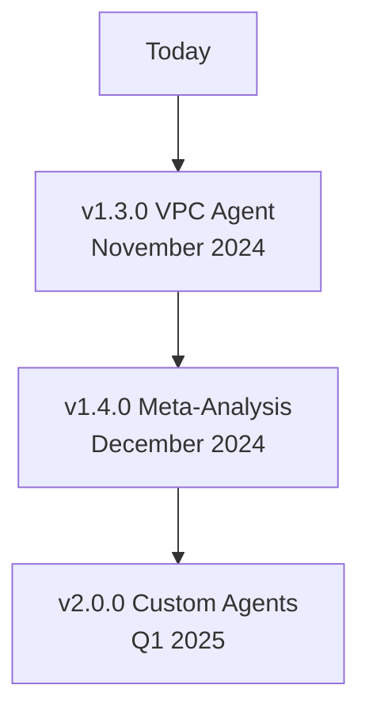

## Recent Updates

<Callout kind="info">
Stay current with Malek's evolution. Each release brings new AI agents, workflow improvements, and enhanced compliance features for your pharmacometrics teams.
</Callout>

<Update label="2024-10-15" description="v1.2.0" tags={["feature", "improvement"]}>

## New Features

- Added NCA Analysis Agent: Perform non-compartmental analysis directly on your PK data with automated parameter estimation and diagnostic plots.
- Introduced PopPK Model Builder: Build and fit population PK models using verified statistical methods, supporting NLME workflows.
- Enhanced Regulatory Intelligence: Now includes EMA guidance search alongside FDA, with inline citations and compliance checklists.

## Improvements

- Workflow Automation: Added AI debate mode for model validation, allowing agents to cross-check results before final output.
- Publication-Ready Charts: Upgraded Plotly integration for VPCs and forest plots with customizable themes.

## Bug Fixes

- Fixed intermittent timeout issues in long-running simulations.
- Resolved data upload errors for CSV files exceeding 10MB.

</Update>

<Update label="2024-09-20" description="v1.1.0" tags={["feature", "bugfix"]}>

## New Features

- Team Collaboration Dashboard: Project-level RBAC with shared knowledge bases and real-time co-editing for reports.
- Dosing Simulation Agent: Simulate regimens across populations with uncertainty visualization.

## Improvements

- 21 CFR Part 11 Compliance: Implemented hash-chained audit logs and electronic signatures for all agent interactions.

## Bug Fixes

- Corrected dose proportionality checks for multi-dose studies.
- Improved error handling in regulatory report generation.

</Update>

<Update label="2024-08-10" description="v1.0.0" tags={["feature", "breaking"]}>

## Initial Release

- Launched 29 specialized AI agents across 8 departments for pharmacometrics.
- Core capabilities: NCA, PopPK, PK/PD analysis, regulatory intelligence, and workflow automation.
- Basic team features with multi-org support.

## Breaking Changes

- Updated API endpoints to `https://api.malek.ai/v1/` (previously beta endpoints).

</Update>

## Upcoming Features

<Columns cols={3}>
  <Card title="Advanced VPC Agent" icon="trending-up" href="#">
    Virtual goodness-of-fit plots with automated residual analysis.
  </Card>
  <Card title="Cross-Study Meta-Analysis" icon="bar-chart" href="#">
    Aggregate results across multiple studies for meta-PK insights.
  </Card>
  <Card title="Custom Agent Builder" icon="settings" href="#">
    Train domain-specific agents on your proprietary data.
  </Card>
</Columns>

<Expandable title="Preview Timeline" default-open="true">


</Expandable>

## How to Update

Follow these steps to ensure you have the latest version of Malek.

<Steps>
  <Step title="Check Current Version" icon="info">

Visit your dashboard at `https://dashboard.malek.ai` and navigate to Settings > About.

  </Step>
  <Step title="Update via CLI" icon="download">

<CodeGroup tabs="npm,yarn">
````bash
npm update malek-cli
````
````bash
yarn upgrade malek-cli
````
</CodeGroup>

Run `malek version` to verify.

  </Step>
  <Step title="Restart Agents" icon="refresh-cw">

```bash
malek restart --all
```

This reloads all 29 AI agents with the latest models.

  </Step>
</Steps>

<Callout kind="tip">
Subscribe to notifications in your account settings to get email alerts for new releases. Check the [dashboard](https://dashboard.malek.ai) regularly for beta features.
</Callout>