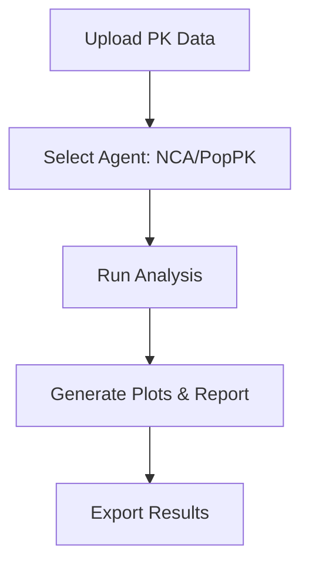

## Overview

Malek provides a chat-first workspace with 29 specialized AI agents across 8 departments, tailored for pharmaceutical sciences. You can perform non-compartmental analysis (NCA), population pharmacokinetics (PopPK), generate regulatory reports, create publication-ready charts, and collaborate seamlessly. All features emphasize regulatory compliance and workflow efficiency.

<Callout kind="info">
Malek agents use validated statistical methods and maintain 21 CFR Part 11 compliance through audit logs and electronic signatures.
</Callout>

## Key Capabilities

Discover Malek's core strengths through these specialized areas.

<Columns cols={3}>
  <Card title="NCA & PopPK Analysis" icon="activity" href="#nca-poppk">
    Perform NCA and PopPK modeling with AI-guided workflows.
  </Card>
  <Card title="Regulatory Intelligence" icon="book-open" href="#regulatory">
    Search FDA, EMA, and ICH guidance with inline citations.
  </Card>
  <Card title="Publication-Ready Charts" icon="bar-chart-3" href="#charts">
    Generate diagnostic plots, VPCs, and forest plots.
  </Card>
  <Card title="Team Collaboration" icon="users" href="#collaboration">
    Share projects with RBAC and knowledge bases.
  </Card>
</Columns>

## NCA and PopPK Analysis

Malek's AI agents handle NCA for quick PK parameter estimation and PopPK for complex population modeling. Upload your PK data and chat to run analyses.

<Tabs>
  <Tab title="NCA Workflow" icon="zap">
    <Steps>
      <Step title="Upload Data" icon="upload">
        Share your CSV with concentration-time data.
      </Step>
      <Step title="Run NCA" icon="play">
        Ask: "Perform NCA on this PK dataset."
      </Step>
      <Step title="Review Results" icon="check-circle">
        Get AUC, Cmax, and lambda_z with confidence intervals.
      </Step>
    </Steps>
  </Tab>
  <Tab title="PopPK Modeling" icon="trending-up">
    <Steps>
      <Step title="Prepare Covariates" icon="settings">
        Include demographics and dose information.
      </Step>
      <Step title="Build Model" icon="code">
        Prompt: "Fit a 2-compartment PopPK model."
      </Step>
      <Step title="Validate" icon="shield">
        Review VPC plots and parameter estimates.
      </Step>
    </Steps>
  </Tab>
</Tabs>



## Regulatory Intelligence

Query regulatory guidance directly in chat. Malek cites sources inline and verifies compliance.

<CodeGroup tabs="FDA Guidance,EMA Query">
  ```plaintext
  Prompt: Summarize FDA guidance on bioequivalence.
  Response: FDA 2013 Guidance states... [Citation: FDA.gov/bioequivalence]
  ```
  ```plaintext
  Prompt: Check EMA requirements for PopPK in submissions.
  Response: EMA guideline CPMP/EWP... requires VPC [Citation: EMA.europa.eu]
  ```
</CodeGroup>

<Callout kind="tip">
Always verify citations against official sources for submissions.
</Callout>

## Publication-Ready Charts

Create high-quality plots powered by Plotly. From spaghetti plots to VPCs, export directly to publications.

<Expandable title="Example VPC Plot Configuration" default-open="false">
Use this Python snippet to integrate Malek-generated data:

````python
import plotly.graph_objects as go
import pandas as pd

df = pd.read_csv('malek_vpc_data.csv')  # From Malek export

fig = go.Figure()
fig.add_trace(go.Scatter(x=df['time'], y=df['median'], mode='lines', name='Median'))
fig.add_trace(go.Scatter(x=df['time'], y=df['q90'], mode='lines', fill=None, name='90% PI', line=dict(dash='dash')))
fig.update_layout(title="VPC Plot from Malek")
fig.show()
````
</Expandable>

## Team Collaboration and Knowledge Base

Collaborate with role-based access control (RBAC), shared workspaces, and a persistent knowledge base.

| Feature | Description | Benefits |
|---------|-------------|----------|
| Project RBAC | Admin, Viewer, Editor roles | Secure access control |
| Shared Knowledge Base | Store protocols and datasets | Reuse across teams |
| Audit Logs | Immutable records | 21 CFR Part 11 compliance |
| Multi-Org Support | Separate workspaces | Enterprise scalability |

<Callout kind="success">
Start collaborating by inviting team members via the dashboard at `https://dashboard.malek.ai`.
</Callout>

Invite your team and build workflows together. Malek streamlines pharmacometrics from analysis to reporting.